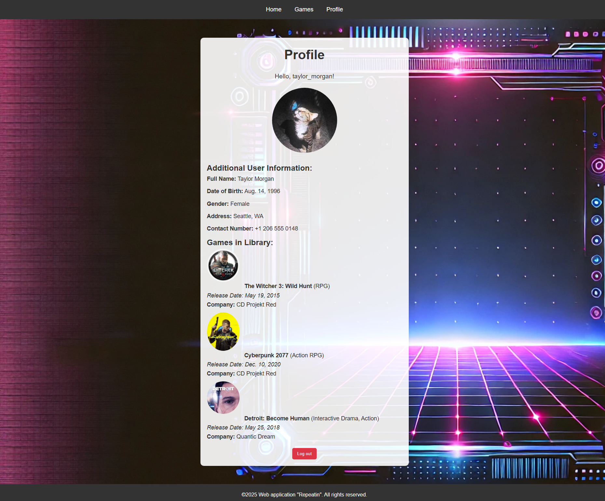

# Game Web Repeatin

Game Web Repeatin is a Django web application for browsing, buying, and managing a video game catalog.

Users can explore available games, view details, and build their personal game library. Admins can manage games, users, and purchases through the Django admin panel.

## Features

### Users

- Browse a catalog of video games
- View game details, covers, genres, release dates, and prices
- Purchase games through the web interface
- See owned games on the profile page

### Admins

- Add, edit, and delete games
- Manage users and profile data
- Review user libraries and purchases
- Use the built-in Django admin panel

## Tech Stack

- Python 3.x
- Django
- SQLite3 for local development
- HTML and CSS templates

## Screenshots

### Games Store


### User Profile



### Admin Panel


## Getting Started

### 1. Clone the repository

```bash
git clone https://github.com/MiroCoder/game-web-repeatin.git
cd game-web-repeatin
```

### 2. Create a virtual environment

For Windows:

```bash
python -m venv venv
venv\Scripts\activate
```

For Linux or macOS:

```bash
python3 -m venv venv
source venv/bin/activate
```

### 3. Install dependencies

```bash
pip install -r requirements.txt
```

If `requirements.txt` is not available, install Django manually:

```bash
pip install django
```

### 4. Apply migrations

```bash
python manage.py migrate
```

### 5. Create an admin user

```bash
python manage.py createsuperuser
```

### 6. Run the development server

```bash
python manage.py runserver
```

Open the app in your browser:

```text
http://127.0.0.1:8000
```

## Admin Panel

The admin panel is available at:

```text
http://127.0.0.1:8000/admin
```

Use the superuser account created during setup to manage games, users, and profile data.

## Media Files

Uploaded game images are stored in the `media/` directory during development.

For local media support, make sure your URL configuration includes:

```python
from django.conf import settings
from django.conf.urls.static import static

urlpatterns = [
    # Your URL patterns here...
]

if settings.DEBUG:
    urlpatterns += static(settings.MEDIA_URL, document_root=settings.MEDIA_ROOT)
```

## Roadmap

- Add reviews and ratings
- Add search and filtering
- Improve the visual design
- Integrate a payment provider

## Author

Made by [MiroCoder](https://github.com/MiroCoder)
