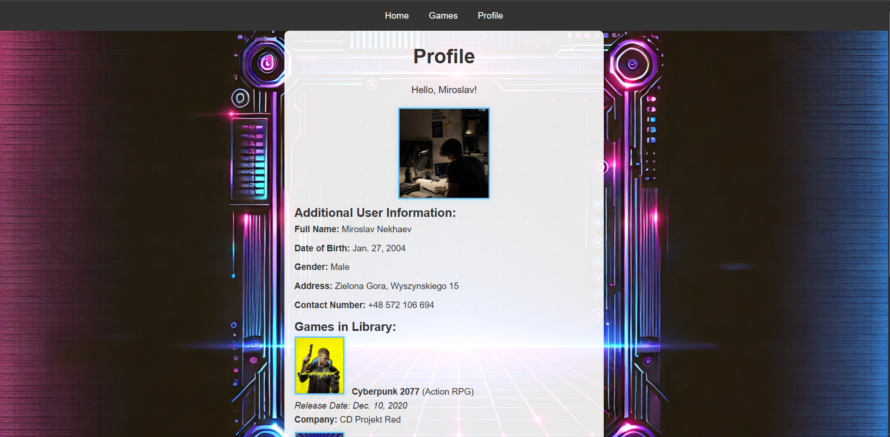

# Django Game Store

Django web application for browsing a video-game catalog, purchasing games and managing a personal game library.

## Screenshots

### Store


### User Profile


### Admin Panel


## Features

- Browse games with covers, genres, release dates and prices
- View game details
- Add purchased games to a personal library
- User profiles and authentication
- Django Admin for games and users
- Image uploads for game covers

## Tech Stack

- Python
- Django
- Django ORM
- SQLite
- Pillow
- HTML / CSS

## Run Locally

```bash
git clone https://github.com/MiroCoder/django-game-store-web-app.git
cd django-game-store-web-app
python -m venv .venv
```

Windows PowerShell:

```powershell
.\.venv\Scripts\Activate.ps1
python -m pip install -r requirements.txt
python manage.py migrate
python manage.py createsuperuser
python manage.py runserver
```

Open:

```text
http://127.0.0.1:8000
```

Admin:

```text
http://127.0.0.1:8000/admin/
```

## Media

Game covers are handled through Django `ImageField` and stored under `media/` during local development.

## Project Structure

```text
mainapp/         # Models, forms, views, templates and static files
video_games/     # Django project configuration
media/           # Demo/uploaded game covers
screenshots/     # README previews
manage.py
requirements.txt
```

## Next Improvements

- Search and filtering
- Reviews and ratings
- Automated tests
- PostgreSQL configuration
- REST API layer

## Author

[Miroslav Nekhaev / MiroCoder](https://github.com/MiroCoder)
